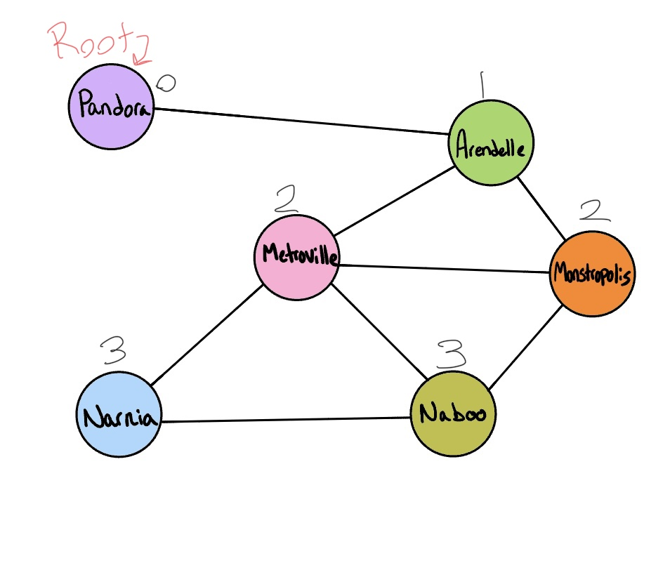

# Code Challenge
Implement a breadth-first traversal on a graph

- [Click here](./breadth_first.py) for code implementation
- [Click here](../tests/test_breadth_first.py) for unit tests
# Feature Tasks
- Extend your graph object with a breadth-first traversal method that accepts a starting node. 
- Without utilizing any of the built-in methods available to your language, return a collection of nodes in the order they were visited. 
- Display the collection.

## Example


**Output**: 
`Pandora, Arendelle, Metroville, Monstroplolis, Narnia, Naboo`

## Approach
As this is a breadth-first implementation, by looking at the example image input and output above, it's clear that `Pandora` is my root, or start node. I'll need to utilize my Graph and Queue data structures in order to enqueue and dequeue so that I can keep track of _visited_ nodes as I traverse through the collection. 

## Visual

The visual above shows the order in which the nodes will be added to the queue. 
- Pandora is my root node and will enqueue first
- Arendelle will be added second as it's one level away from the root
  - Metroville and Monstropolis are two levels away from the root
  - Narnia and Naboo are three levels away from the root

### Algorithm:
```
AGORITHM BreadthFirst(vertex)
  DECLARE <-- new nodes list
  DECLARE <-- new Queue()
  DECLARE <-- new Set()
  
  breadth.enqueue(vertex)
  visited.Add(vertex)

  while breadth is not empty
    DECLARE front <-- breadth.Dequeue()
    nodes.Add(front)

    for child in front.Children
      if child is not visited
        visited.Add(child)
        breadth.Enqueue(child)
  return nodes
```
1. Start node is `Pandora`
2. First, enqueue the root
3. I also need to add the root to the visited set
4. Begin traversal using while loop, keep running until there are no more nodes in queue
5. Once in the while loop, Dequeue the front node, then check to see if it has any children
6. If there are children of the current node, add them to the visited set, this will prevent an infinite loop if the graph was cyclic. Additionally, place any of its children that have not been visited into the queue
7. Repeat until queue is empty
8. Once while loop continues, this will return a list of nodes in the order they were traversed.

### Big O
- Time - O(1) since every vertex and edge will be explored in the worst case
- Space - O(1) will be the same as time for the same reasons

## Structure and Testing
Utilize the Single-responsibility principle: any methods you write should be clean, reusable, abstract component parts to the whole challenge. You will be given feedback and marked down if you attempt to define a large, complex algorithm in one function definition.

- Write at least three test assertions for each method that you define.

### Stretch goal
Once you’ve achieved a working solution, define a new method that accepts two nodes as input and uses your traversal algorithm to determine if a path exists between the two nodes.