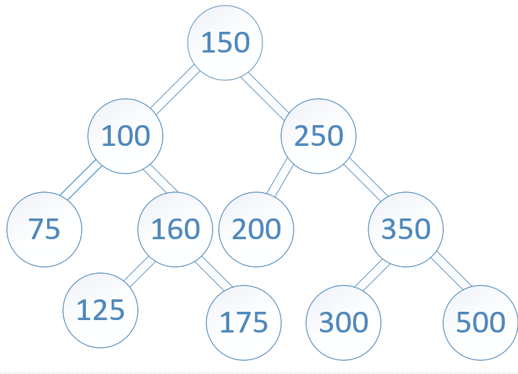

# Code Challenge

Find common values in two binary trees

- [Click here](./tree_intersection.py) for code implementation
- [Click here](../tests/test_tree_intersection.py) for unit tests

## Feature Tasks

- Write a function called tree_intersection that takes two binary tree parameters
- Without utilizing any of the built-in methods available to your language, return a set of values found in both trees

Example Input:

Binary Tree One

Binary Tree Two

Output -> [100,160,125,175,200,350,500]

## Approach and Efficiency
Algorithm:

1. Create node class that holds value for key, left, and right
2. Create tree_intersection function and recursively check if two given binary trees are identical or not
3. If both trees are empty, return true
4. If both trees not empty and the value of their root node matches, recur for their left and right subtree

Time complexity should be O(n^2) as I'll need to build up my tree n number of times then take another n times to find common nodes
Space should be O(1)

